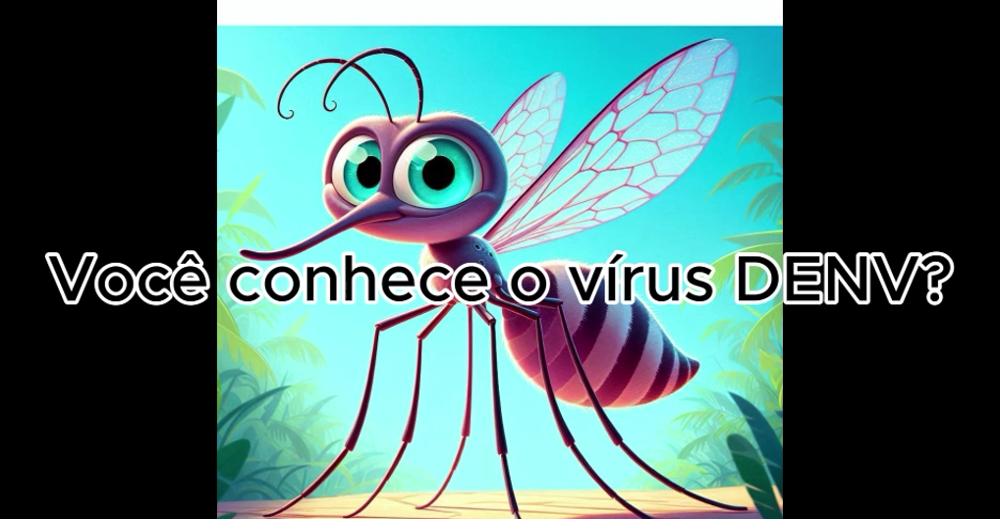

# Criar um vídeo educativo utilizando ferramentas de IA

  
  
  

## 📒 Descrição
Este projeto consiste na criação de um vídeo educativo sobre a dengue, utilizando ferramentas de inteligência artificial para gerar o conteúdo e a edição do vídeo.

## 🤖 Tecnologias Utilizadas
- ChatGPT para a geração do roteiro
- DALL-E para a criação de imagens ilustrativas
- CapCut para a narração do vídeo e a edição final do vídeo

## 🧐 Processo de Criação
1. Utilizamos o ChatGPT para gerar um roteiro detalhado sobre a dengue, incluindo informações sobre prevenção, sintomas e tratamento. (https://www.gov.br/saude/pt-br/assuntos/saude-de-a-a-z/d/dengue)
2. Com o roteiro em mãos, utilizamos o DALL-E para criar imagens ilustrativas que complementassem o conteúdo do vídeo.
3. Em seguida, utilizamos o CapCut para que narrasse o vídeo, utilizando o roteiro gerado pelo ChatGPT.
4. Por fim, editamos o vídeo no CapCut, combinando as imagens e narrações geradas pelas ferramentas de IA.

## 🚀 Resultados
O resultado final é um vídeo educativo de alta qualidade sobre a dengue, que pode ser utilizado em campanhas de conscientização e educação sobre a doença.

## 📹 Vídeo
[Assista ao vídeo educativo sobre a dengue](Dengue.mp4)

## 💭 Reflexão
Criar um vídeo educativo utilizando ferramentas de IA foi um desafio interessante. A integração das diferentes tecnologias permitiu a criação de um conteúdo coeso e informativo, demonstrando o potencial das IAs generativas na produção de materiais educativos.